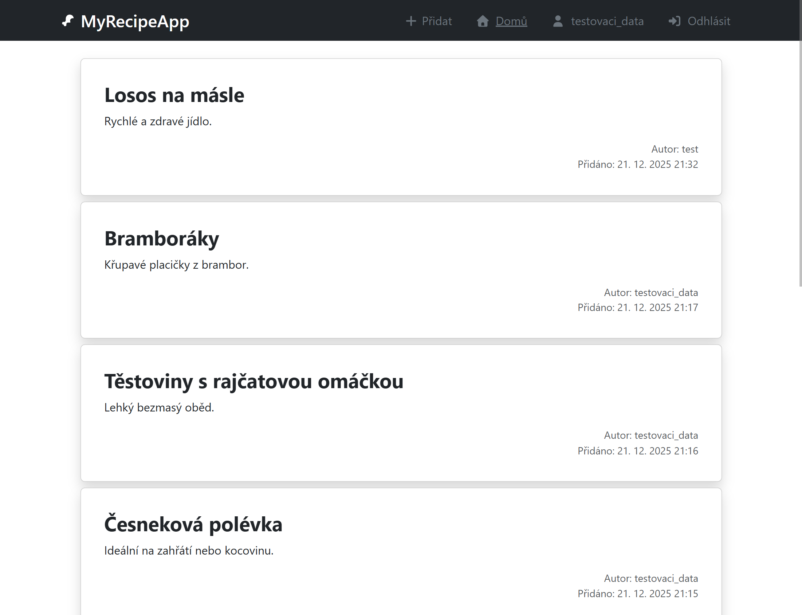
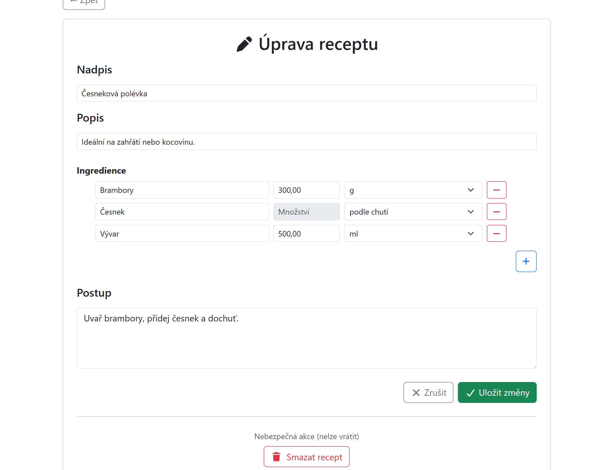

# 🍽️ MyRecipeApp
### Full-stack Recipe Platform built with **React**, **PHP** and **MySQL**

MyRecipeApp je moderní webová aplikace pro správu receptů.  
Umožňuje registraci uživatelů, přihlášení, správu profilu, vytváření, úpravu a smazání receptů.
Každý uživatel má možnost přidat, upravovat a mazat své komentáře u receptů.
Admin má právo upravovat a mazat veškeré recepty i komentáře nezávisle na autorovi.

---

## 📸 Ukázka aplikace




---

## ✨ Features

### 🔐 Authentication
- 👤 Registrace nového uživatele  
- 🔑 Přihlášení pomocí nickname + hesla  
- 🛡️ Bezpečné ukládání hesel (`password_hash`)  
- 🔄 Session mezi Reactem a PHP  

### 👥 User Profile
- ✉️ Změna emailu  
- 📝 Změna nickname  
- 🔒 Změna hesla  
- 📚 Možnost smazání účtu

### 🎨 Frontend (React)
- ⚛️ React 18  
- 🧭 React Router  
- 🎛️ Bootstrap 5  
- 🧩 Komponentová architektura  
- 🔧 Správa stavu přihlášeného uživatele  

### 🛠️ Backend (PHP)
- 🌐 REST API endpoints  
- 💾 PDO + prepared statements  
- 📤📥 JSON komunikace  
- 🧱 Oddělené moduly: auth, profile, recipes  

### 🗄️ Database (MySQL)
Tabulky:
- 🧑 `users`
- 🍽️ `recipes`
- 🍕 `ingredients`
- 💬 `comments`

---

## 🚀 Installation & Setup

### 1️⃣ Backend (PHP + MySQL)

1. Nakopírujte složku do `htdocs` (XAMPP).  
2. Vytvořte databázi.  
3. Importujte SQL strukturu.  
4. Upravte konfiguraci: backend/config/database.php
5. Spusťte Apache + MySQL.
❗ Backend musí běžet na `http://localhost/projekty/MyRecipeApp/`

---

### 2️⃣ Frontend (React)

```bash
cd frontend
npm install
npm run dev
```
❗Fronted musí běžet na localhost:5173

---

## 🧩 API Overview

### 🔐 Auth
- `POST /auth/register.php`
- `POST /auth/login.php`
- `GET /auth/logout.php`

### 👤 Profile
- `POST /profile/updateEmail.php`
- `POST /profile/updateNickname.php`
- `POST /profile/updatePassword.php`

---

## 🧰 Tech Stack
- **Frontend:** React 18, React Router, Bootstrap  
- **Backend:** PHP 8, PDO  
- **Database:** MySQL  
- **API:** JSON REST  

---

## 🛠️ Testovací data
Níže najdete testovací účty, které lze použít pro přihlášení do aplikace:

### 👤 Testovací uživatel – admin

| Položka            | Hodnota          | Popis                |
|--------------------|------------------|----------------------|
| 🧑 **Nickname**     | `testovaci_data` | Přihlašovací jméno   |
| 🔑 **Heslo**        | `testovaciData`  | Heslo účtu           |
| 🛡️ **Role**        | `admin`          | Administrátorská práva |

---

### 👤 Testovací uživatel – běžný uživatel

| Položka            | Hodnota          | Popis              |
|--------------------|------------------|--------------------|
| 🧑 **Nickname**     | `test_user`      | Přihlašovací jméno |
| 🔑 **Heslo**        | `testovaciData`  | Heslo účtu         |
| 🛡️ **Role**        | `user`           | Běžný uživatel     |


---

## 🚀 Plány s projektem

- ⭐ Hodnocení receptů
- 💬 Komentáře k receptům ✔️
- 🔔 Notifikace (nový komentář)
- 🔍 Řazení a filtrování


